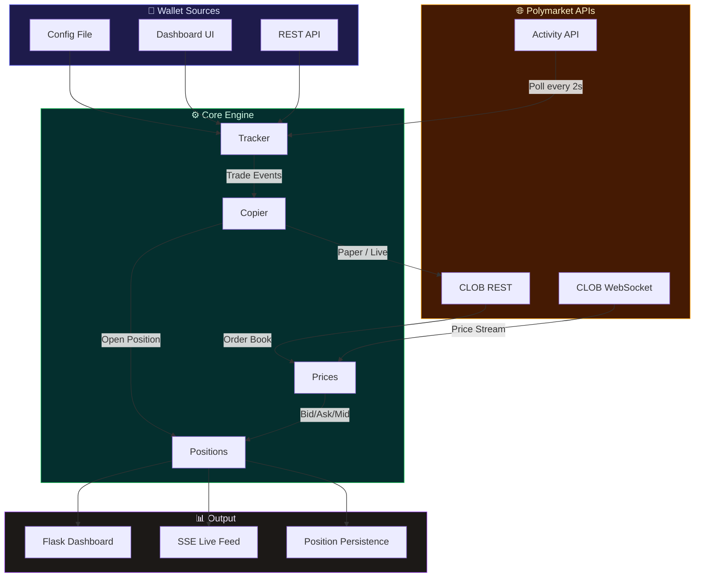
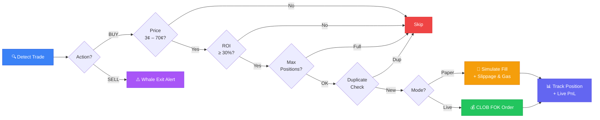
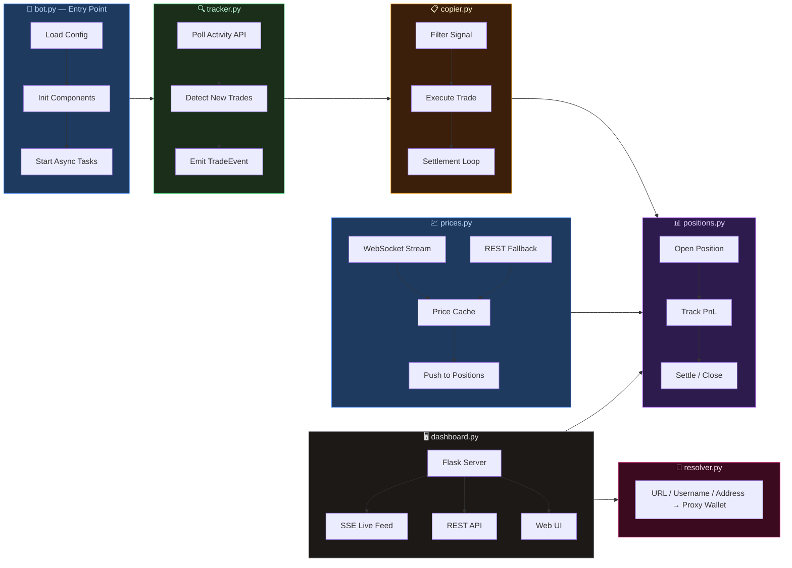
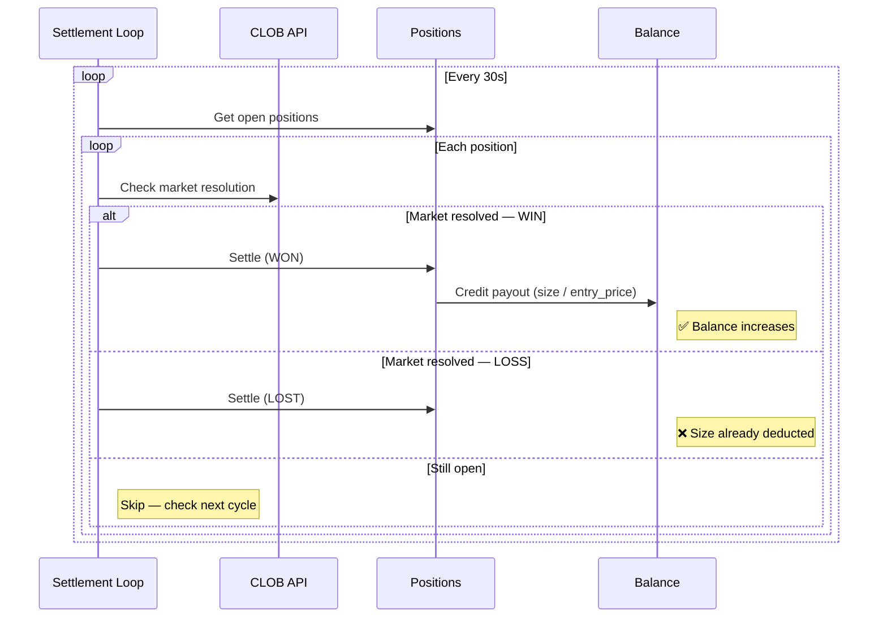

<div align="center">

# Polymarket Copy Trading Bot

**Automatically copy trades from top Polymarket wallets with smart filtering, paper trading, and a real-time dashboard.**

[](https://python.org)
[](LICENSE)
[](https://polymarket.com)
[](https://flask.palletsprojects.com)
[](https://docs.python.org/3/library/asyncio.html)

</div>

---

## Architecture Overview



## Trade Execution Flow



## Features

| Feature | Description |
|---------|-------------|
| **Multi-Wallet Tracking** | Monitor unlimited Polymarket wallets simultaneously |
| **Smart Copy Engine** | Filters by entry price range, ROI threshold, dedup window |
| **Paper Trading** | Full simulation with slippage, gas fees, and FOK rejection |
| **Live Trading** | Real CLOB orders via Polymarket API (FOK) |
| **Web Dashboard** | Real-time positions, PnL, trade feed at `localhost:8080` |
| **Profile Resolver** | Add wallets by URL, username, or `0x` address |
| **Whale Exit Alerts** | Detects when tracked wallets sell positions you hold |
| **Live Prices** | WebSocket + REST fallback for bid/ask/mid |
| **Auto Settlement** | Detects market resolution, credits wins, debits losses |
| **Hot-Reload Config** | Change settings without restart |

## Quick Start

```bash
# Clone
git clone https://github.com/gnaneshwarvasala/polymarket-copy-bot.git
cd polymarket-copy-bot

# Install
pip install -r requirements.txt

# Configure
cp config.example.toml config.toml
# Edit config.toml — add wallet addresses to track

# Run (paper mode by default)
python bot.py

# Dashboard → http://localhost:8080
```

## Configuration

```toml
[mode]
paper = true                    # true = simulation, false = real USDC
paper_balance = 1000.0

[copy]
min_profit_pct = 30.0           # Min ROI% to copy (30 = max entry ~77¢)
max_entry_price = 0.70          # Max entry price (0.70 = 70¢)
min_entry_price = 0.03          # Skip dust trades below 3¢
position_size = 10.0            # USDC per trade
max_positions = 20              # Max concurrent positions
dedup_window_secs = 60          # Block same market+side within N seconds

[wallets]
track = [
    "0xed107a85a4585a381e48c7f7ca4144909e7dd2e5",
]

[poll]
interval_secs = 2
trades_per_wallet = 20

[dashboard]
enabled = true
port = 8080
```

## Adding Wallets

Three ways to add wallets — all formats auto-resolve:

```
https://polymarket.com/profile/scottilicious   →  profile URL
scottilicious                                   →  username
0x000d257d2dc7616feaef4ae0f14600fdf50a758e      →  direct address
```

| Method | How |
|--------|-----|
| **Config** | Add to `[wallets] track` in `config.toml` |
| **Dashboard** | Type in the "Add wallet" field |
| **API** | `POST /api/wallet/add {"input": "scottilicious"}` |

## System Architecture



## Dashboard

Open `http://localhost:8080` after starting the bot:

| Panel | Shows |
|-------|-------|
| **Stats Bar** | Balance, Unrealized PnL, Realized PnL, Total PnL |
| **Positions Table** | Market, Side, Size, Entry, Bid, Ask, Spread, PnL |
| **Live Feed** | Real-time stream of detections, copies, fills, settlements |
| **Wallet List** | All tracked wallets with add/remove controls |

## API Reference

| Endpoint | Method | Description |
|----------|--------|-------------|
| `/api/status` | `GET` | Bot status, balance, position count |
| `/api/positions` | `GET` | All open positions with live prices |
| `/api/wallets` | `GET` | Tracked wallets list |
| `/api/wallet/add` | `POST` | Add wallet — `{"input": "0x..."}` |
| `/api/wallet/remove` | `POST` | Remove wallet — `{"wallet": "0x..."}` |
| `/api/trades` | `GET` | Trade history |
| `/api/feed` | `GET` | SSE live event stream |
| `/api/pause` | `POST` | Pause trading |
| `/api/resume` | `POST` | Resume trading |

## Settlement Flow



## Live Trading

> **Use at your own risk. Always start with paper mode.**

Set environment variables:

```bash
export POLY_KEY="your-api-key"
export POLY_SECRET="your-api-secret"
export POLY_PASSPHRASE="your-passphrase"
export POLY_PRIVATE_KEY="your-private-key"
```

Then in `config.toml`:

```toml
[mode]
paper = false
```

## Tech Stack

| Component | Technology |
|-----------|-----------|
| **Runtime** | Python 3.10+ / asyncio |
| **HTTP Client** | aiohttp |
| **WebSocket** | websockets |
| **Dashboard** | Flask + Server-Sent Events |
| **Config** | TOML (tomli) |
| **Persistence** | JSON file storage |

## License

[MIT](LICENSE)

---

<div align="center">

`#polymarket` `#copy-trading` `#trading-bot` `#python` `#prediction-markets` `#crypto` `#defi` `#asyncio` `#flask` `#websocket` `#paper-trading` `#clob` `#automated-trading`

</div>
